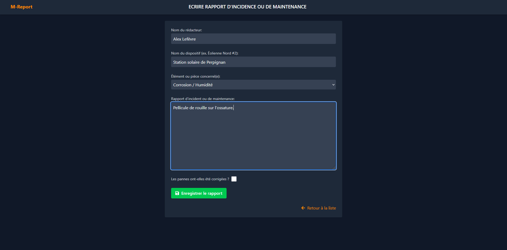
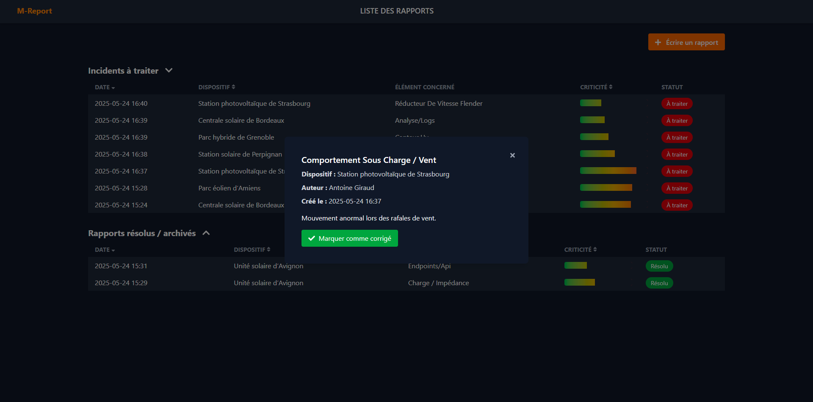
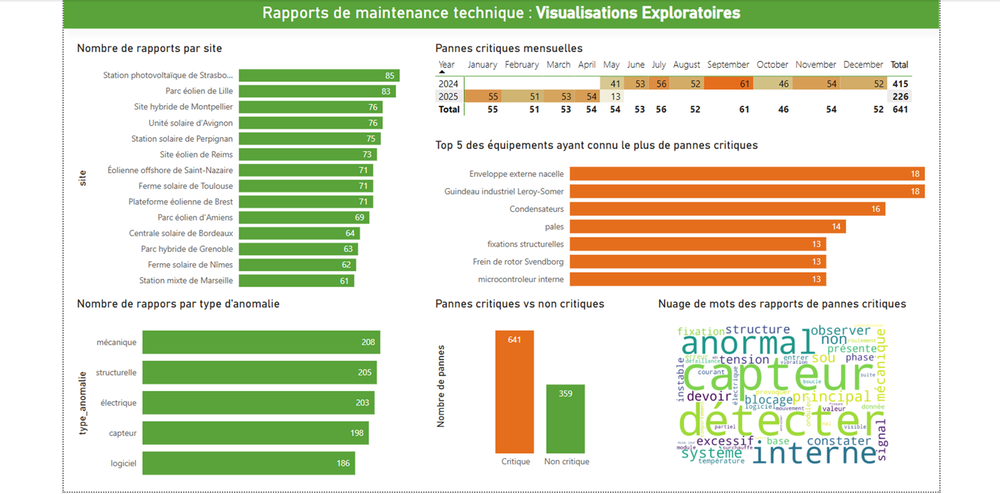
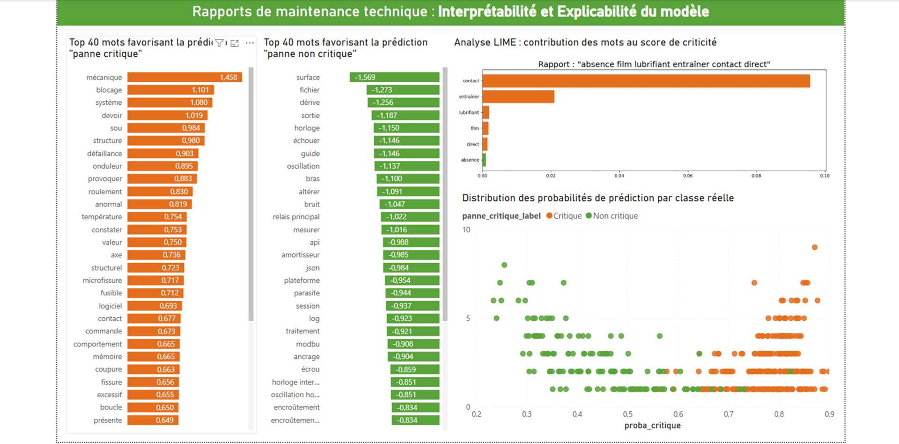

# 🛠 NLP & Maintenance Prédictive

## 📌 Titre :

**Prédiction des défaillances dans les installations solaires/éoliennes via l’analyse sémantique**

---

## 🎯 Objectifs du Projet

### Objectifs principaux :

* Analyser automatiquement les rapports techniques des installations solaires et éoliennes.
* Détecter précocement les signaux faibles (anomalies récurrentes, pannes critiques) grâce aux techniques NLP.
* Aider les équipes techniques à identifier rapidement les équipements à risque afin d'améliorer la réactivité face aux défaillances potentielles.

### Objectifs secondaires :

* Explorer les performances d’un modèle NLP supervisé pour prédire la criticité des incidents.
* Développer une application web intuitive permettant la consultation, la saisie et la gestion proactive des rapports techniques.
* Visualiser les résultats de prédiction et les performances du modèle via des tableaux de bord interactifs (Power BI).

---

## 📚 Sources de Données

### 🔸 Données utilisées :

* **Structurées** : Dataset synthétique CSV (`rapport_maintenance_synthetique.csv`)

  * Colonnes : `rapport` (texte), `panne_critique` (0 ou 1).
* **Non structurées** : Rapports textuels simulés, inspirés des incidents fréquents dans les installations solaires/éoliennes réelles.

### 🔸 Description :

Ces données synthétiques simulent de manière réaliste les descriptions des pannes et anomalies couramment rencontrées dans les équipements industriels spécifiques aux secteurs solaire et éolien.

---

## 🧠 Traitements NLP effectués

### 🔸 Prétraitement des textes :

* Nettoyage avancé des textes (minuscules, suppression ponctuations et chiffres).
* Lemmatisation et suppression des stopwords français avec `spaCy` (`fr_core_news_lg`).
* Génération d’une colonne nettoyée `rapport_clean`.

### 🔸 Vectorisation & Modélisation :

* Transformation des textes via **TF-IDF** (Term Frequency-Inverse Document Frequency).
* Classification supervisée par **régression logistique** (`scikit-learn`).
* Séparation entraînement/test : 70/30.

### 🔸 Évaluation & Interprétabilité :

* Mesure des performances : Accuracy, Precision, Recall, F1-score, ROC-AUC.
* Courbes de performance (ROC, calibration, gain cumulée).
* Matrice de confusion.
* Analyse LIME (contribution des mots aux prédictions).

---

## 🌐 Présentation de l’Application Web

Une plateforme web interactive (Django) a été développée afin d'exploiter efficacement le modèle NLP et fournir aux utilisateurs un outil pratique pour :

### 🔹 Saisie des Rapports :

* Formulaire intuitif permettant la rédaction de nouveaux rapports techniques (auteur, dispositif, élément concerné, texte libre).
* Possibilité d'indiquer si la panne a été corrigée lors de la saisie initiale.



### 🔹 Consultation Dynamique :

* Page principale affichant deux catégories :

  * **Incidents à traiter :** Rapports non résolus, avec criticité prédite affichée sous forme de barre colorée (vert-jaune-rouge).
  * **Incidents résolus / archivés :** Historique des rapports clôturés.
* Tri rapide et interactif des rapports par date, dispositif ou criticité.


### 🔹 Visualisation détaillée :

* Modal interactif affichant les détails complets du rapport (texte intégral, auteur, dispositif concerné).
* Option pour marquer directement depuis le modal qu'un incident est résolu.



### 🔹 Interface claire et intuitive :

* Style dark-mode, ergonomique et facile à lire.
* Utilisation de Tailwind CSS pour un design réactif et agréable.
* Icônes interactives (FontAwesome) pour améliorer la navigation et l’interaction utilisateur.

---

## 📈 Tableaux de bord Power BI

Des tableaux de bord interactifs ont été créés pour explorer les données, évaluer les performances du modèle et fournir une interprétation claire des résultats :

### 📌 **Page 1 — Exploration des données :**

* Nombre de rapports par site d’installation
* Répartition des types d’anomalies
* Analyse temporelle des incidents critiques
* Équipements les plus souvent sujets aux pannes critiques
* Nuage de mots représentant les mots-clés associés aux incidents critiques



### 📌 **Page 2 — Évaluation du modèle :**

* Affichage des métriques (Accuracy, Precision, Recall, F1-score, ROC AUC)
* Courbe ROC et matrice de confusion
* Courbes de calibration et de gain cumulée


### 📌 **Page 3 — Interprétabilité & Explainabilité :**

* Identification des termes influençant fortement les prédictions critiques/non critiques
* Explications locales des prédictions par la méthode LIME
* Distribution des scores de prédiction par classe réelle



---

## 📊 Résultats et Analyses

* Le modèle NLP permet une identification précise des rapports critiques grâce à une bonne performance générale.
* Certains équipements (turbines éoliennes spécifiques, onduleurs solaires) montrent une fréquence élevée de rapports critiques, clairement identifiés par le modèle.
* L’analyse sémantique a permis d’isoler des mots-clés (ex. « fuite », « usure », « température élevée », « bruit ») associés aux défaillances critiques.

---

## ⚠️ Limites Actuelles du Projet

* **Données synthétiques :** absence de nuances et diversité réelles.
* **Absence de données temporelles réelles :** impossibilité actuelle d'analyser la séquence d’événements et la temporalité des pannes.
* **Modèle simple :** la régression logistique reste efficace mais limitée face à des modèles NLP plus complexes tels que BERT ou Transformers.

---

## 🚀 Perspectives et Améliorations Futures

Afin d’étendre la portée prédictive du projet, les points suivants seront explorés dans les développements futurs :

* ✅ **Intégration d’un jeu de données réel :**

  * Collecte de données historiques de maintenance avec horodatages précis.
  * Analyse des successions d'événements pour anticiper les pannes futures.

* ✅ **Utilisation de modèles NLP avancés :**

  * Application de modèles Transformers (BERT, RoBERTa) pour une meilleure compréhension sémantique contextuelle.

* ✅ **Développement d'une plateforme complète d'analyse prédictive :**

  * Tableau de bord en temps réel pour prédire les incidents avant leur apparition.
  * Système d’alerte préventif intégré à l’application web.

* ✅ **Mise en place d'une validation croisée robuste** pour améliorer la généralisation du modèle.

---

## 📎 Annexes et Ressources du Projet

* 📂 **Fichier Python de création du modèle :**

  ```
  model_creation/Maintenance_predictive.py
  ```
* 📂 **Dataset synthétique (CSV) :**

  ```
  model_creation/rapport_maintenance_synthetique.csv
  ```
* 📂 **Rapport interactif Power BI :**

  ```
  model_creation/rapport_BI.pbix
  ```
* 📂 **Captures d’écran du projet :**

  ```
  screen_shots/
    ├── LIST_REPORTS.png
    ├── MODAL_REPORT.png
    ├── CREATE_REPORT.png
    ├── BI_Visual_Exploratory.png
    ├── BI_Model_Evaluation.png
    └── BI_Interpretability_Explainability.png
  ```
* 🌐 **Dépôt GitHub complet :**

  ```
  https://github.com/<votre-utilisateur>/NLP_Maintenance_Predictive.git
  ```

---

## ✍️ Auteur du Projet

**Tombo H. ANDRIAMAHATANA**
📧 [tomixbo@gmail.com](mailto:tomixbo@gmail.com)
🔗 [GitHub : Tomixbo](https://github.com/Tomixbo)

---
