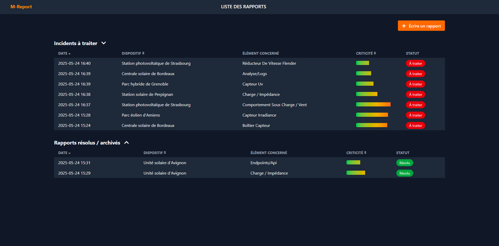
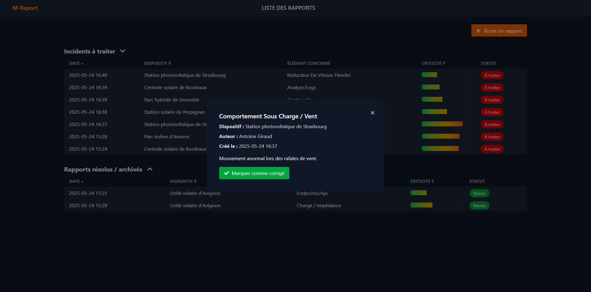
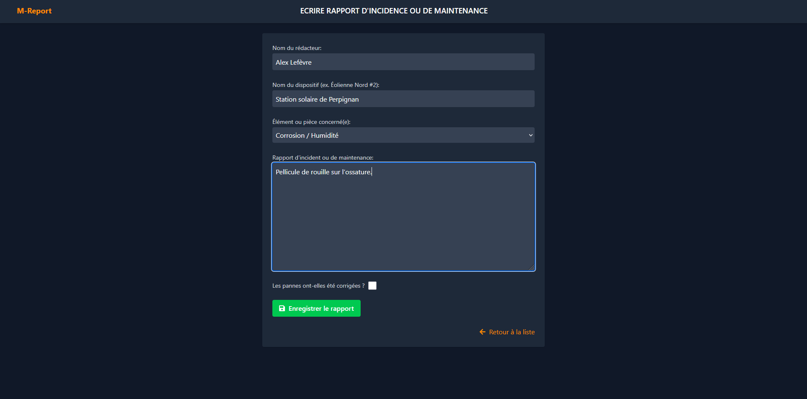
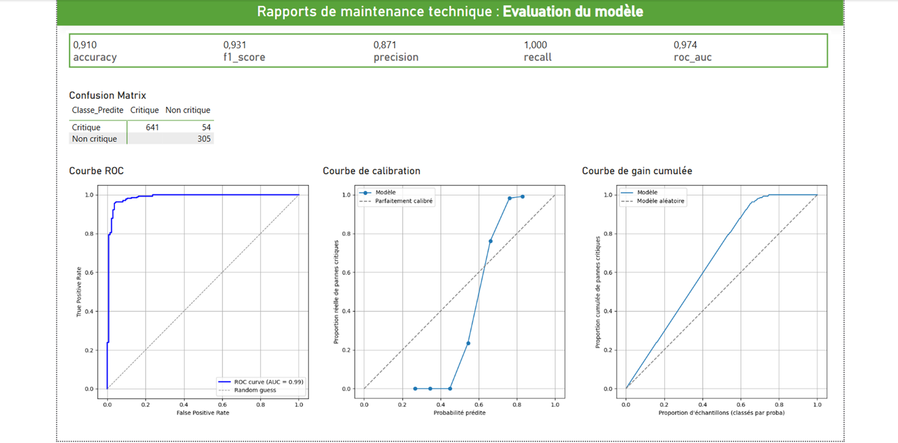
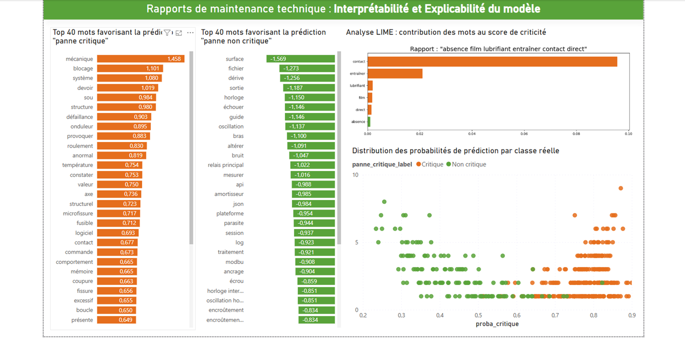

# 🔧 NLP_Maintenance_Predictive

**Plateforme web de maintenance prédictive** basée sur le traitement automatique du langage naturel (**NLP**) pour analyser, classifier et visualiser des rapports techniques.

Le projet associe :
- 🧠 **Un modèle NLP supervisé** (TF-IDF + Logistic Regression),
- 🌐 **Une application web Django** pour la saisie et la consultation des rapports,
- 📈 **Des tableaux de bord Power BI** pour la visualisation exploratoire et l’explication du modèle.

---

## 🎯 Objectif du projet

Ce projet vise à **explorer les techniques de NLP appliquées aux rapports de maintenance** dans un contexte industriel. L'objectif est de :
- Prédire la **criticité** d’un rapport dès sa soumission,
- Catégoriser automatiquement les incidents à traiter en priorité,
- Offrir une **interface visuelle intuitive et explicative** de la logique de prédiction.

---

## 📸 Aperçu de l’application

### 🔍 Liste des rapports


### 📄 Détail d’un rapport (modal)


### ➕ Création d’un nouveau rapport


---

## ⚙️ Installation

### 1. Cloner le dépôt

```bash
git clone https://github.com/<votre-utilisateur>/NLP_Maintenance_Predictive.git
cd NLP_Maintenance_Predictive
````

### 2. Créer un environnement virtuel

```bash
python -m venv venv
source venv/bin/activate  # ou venv\Scripts\activate sous Windows
```

### 3. Installer les dépendances

```bash
pip install -r requirements.txt
```

### 4. Télécharger le modèle linguistique français de spaCy

```bash
python -m spacy download fr_core_news_lg
```

### 5. Appliquer les migrations et lancer l’application

```bash
python manage.py migrate
python manage.py runserver
```

Accédez à l’application via [http://127.0.0.1:8000](http://127.0.0.1:8000)

---

### 🧠 Modélisation NLP

Le modèle d’apprentissage supervisé est entraîné à partir de rapports techniques synthétiques (`rapport_maintenance_synthetique.csv`) dans un notebook Python, avec une approche complète mêlant NLP classique et évaluation de performance :

#### 📋 Étapes du pipeline :

* **Prétraitement avancé des textes** :

  * Nettoyage (minuscules, suppression de ponctuation et chiffres),
  * Lemmatisation et filtrage des stop words via `spaCy` (`fr_core_news_lg`),
  * Colonnes enrichies : `rapport_clean`.

* **Exploration visuelle** :

  * Répartition des classes (`panne_critique`),
  * Nuages de mots par classe (WordCloud),
  * Graphiques de distribution avec `matplotlib` et `seaborn`.

* **Vectorisation & Modélisation** :

  * TF-IDF sur les rapports nettoyés (`rapport_clean`),
  * Régression logistique via `scikit-learn` (`LogisticRegression`),
  * Entraînement / validation via `train_test_split` (70/30).

* **Évaluation du modèle** :

  * Rapport de classification (`precision`, `recall`, `f1-score`),
  * Score ROC AUC, courbe ROC, matrice de confusion,
  * Sauvegarde des artefacts (`logistic_model.pkl`, `tfidf_vectorizer.pkl`).

* **Explication / Interprétation** :

  * Analyse des mots les plus influents par classe (positifs / négatifs),
  * Visualisation LIME (contribution des tokens),
  * Distribution des scores de probabilité par classe réelle.

💡 Le notebook d’entraînement est situé ici :

```
model_creation/Maintenance_predictive.py
```

---

## 📊 Fichier Power BI – rapport\_BI.pbix

Le fichier `rapport_BI.pbix` contient trois onglets interactifs créés avec **Microsoft Power BI** pour explorer, évaluer et expliquer le modèle de prédiction de criticité.

### 🧪 Page 1 — Visualisation exploratoire

> Objectif : mieux comprendre la nature des rapports et la distribution des classes.

Contenu :

* **Nombre de rapports par site**
* **Nombre de rapports par type d'anomalie**
* **Répartition des pannes critiques vs non critiques**
* **Évolution mensuelle des pannes critiques**
* **Top 5 des équipements ayant connu le plus de pannes critiques**
* **Nuage de mots** influents dans les rapports critiques


---

### 📈 Page 2 — Évaluation du modèle

> Objectif : visualiser les métriques de performance du modèle NLP.

Contenu :

* **Accuracy**, **F1-score**, **Precision**, **Recall**, **ROC AUC**
* **Matrice de confusion** binaire
* **Courbe ROC**
* **Courbe de calibration**
* **Courbe de gain cumulée**



---

### 🧠 Page 3 — Interprétabilité & Explication

> Objectif : comprendre **pourquoi** le modèle prédit une criticité élevée ou faible.

Contenu :

* **Top 40 mots favorisant** la prédiction **critique**
* **Top 40 mots favorisant** la prédiction **non critique**
* **Analyse LIME** sur des exemples : importance des mots dans la prédiction
* **Distribution des probabilités** selon la classe réelle



---

## 🗂 Structure du projet

```
NLP_Maintenance_Predictive/
│
├── maintenance_predictive/        # Projet Django
│   ├── reports/                   # App principale
│   │   ├── models.py              # Modèle Report
│   │   ├── views.py               # Vues Django
│   │   ├── templates/reports/     # Templates HTML
│   │   └── ml/ml.py               # Pipeline prédictif
│   ├── .../                       # Autres dossiers/fichiers django
│
├── model_creation/                # Modèle et données
│   ├── Maintenance_predictive.ipynb  # Notebook d'entraînement
│   ├── rapport_maintenance_synthetique.csv
│   └── rapport_BI.pbix
│
├── screen_shots/                   # Captures d'écran (.png)
│   ├── BI_Interpretability_Explainability.png
│   ├── BI_Model_Evaluation.png
│   ├── BI_Visual_Exploratory.png
│   ├── CREATE_REPORT.png
│   ├── LIST_REPORTS.png
│   └── MODAL_REPORT.png
│
├── NLP_Maintenance_Predictive.md  # Description longue du projet
├── requirements.txt               # Dépendances Python
├── LICENSE                        # MIT License
└── README.md                      # Ce fichier
```

---

## 📎 Exemple de prédiction automatique

Dès qu’un utilisateur soumet un rapport :

* Le texte est nettoyé et vectorisé
* Le modèle calcule un score de criticité entre `0.0` et `1.0`
* Le score est affiché sous forme de barre de progression dégradée
* Le rapport est automatiquement classé comme **à traiter** ou **archivé**

---

## 🛡 Licence

Ce projet est sous licence **MIT** — libre de réutilisation, modification et distribution avec attribution.

---

## ✍️ Auteur

Développé dans le cadre d’un projet d’exploration NLP appliqué à la maintenance technique prédictive.
Contact : \[Tombo H. ANDRIAMAHATANA / tomixbo@gmail.com / Tomixbo]

---
